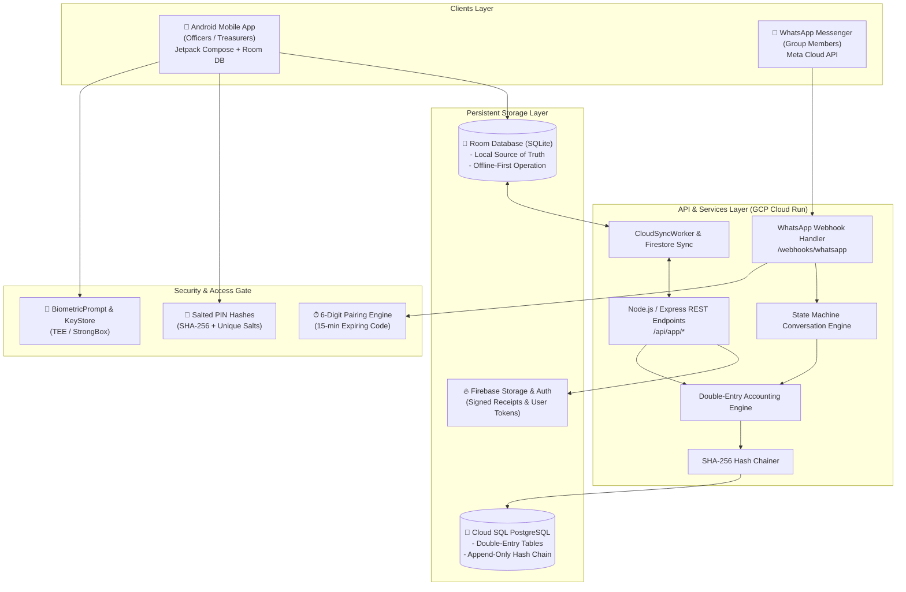
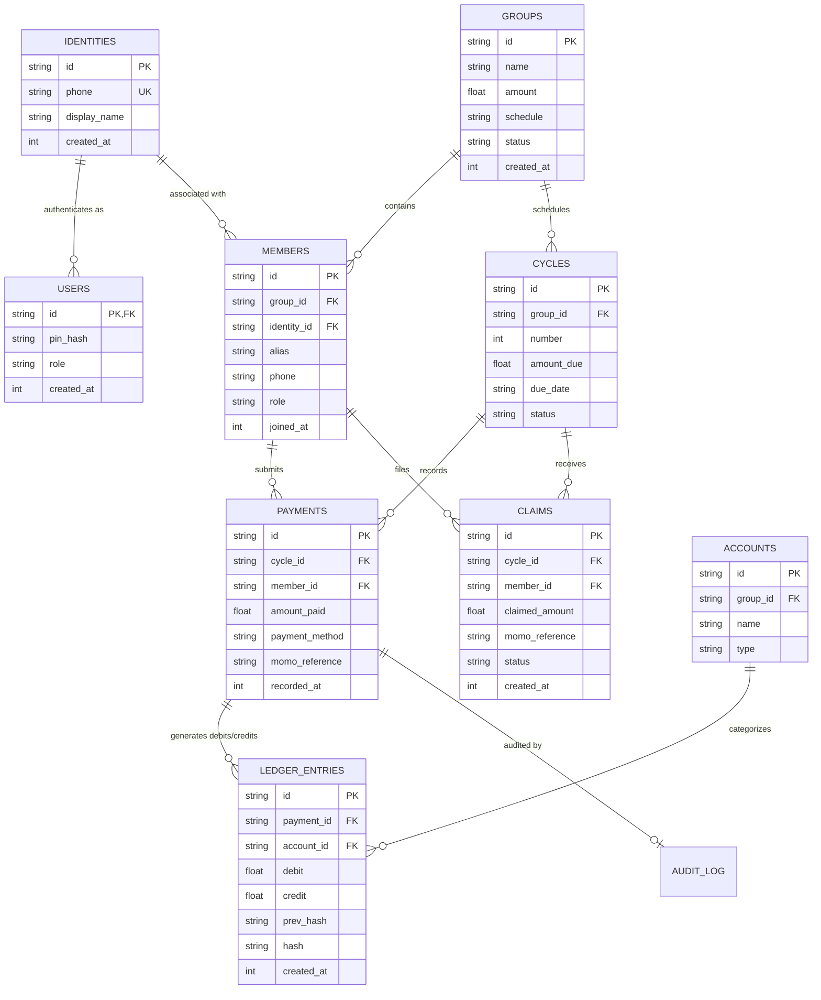

# SusuLedger 🏦🔒

[](https://kotlinlang.org)
[](https://developer.android.com/studio/releases/gradle-plugin)
[](https://developer.android.com/about/versions/14)
[](https://developer.android.com/jetpack/compose)
[](https://m3.material.io)
[](https://developer.android.com/training/data-storage/room)
[](https://robolectric.org)
[](https://github.com/takahirom/roborazzi)
[](docs/DPC_COMPLIANCE_GHANA.md)

**SusuLedger** is an enterprise-grade, cryptographically tamper-proof financial record-keeping platform engineered for Rotating Savings and Credit Associations (ROSCAs), commonly known as **Susu groups** across Ghana and West Africa.

Built around a **"One Brain, Two Faces"** paradigm, SusuLedger pairs a sleek **Jetpack Compose Android Mobile App** for group officers (Treasurers and Second Signatories) with a frictionless **WhatsApp Chat State Machine** for members, anchored by a **SHA-256 cryptographic hash-chain ledger** and a double-entry accounting engine.

---

## 📑 Table of Contents

- [The Problem & The Susu Tradition](#-the-problem--the-susu-tradition)
- [Architecture: "One Brain, Two Faces"](#-architecture-one-brain-two-faces)
- [Key Features & Capabilities](#-key-features--capabilities)
  - [1. Officer Mobile App (Android / Jetpack Compose)](#1-officer-mobile-app-android--jetpack-compose)
  - [2. WhatsApp Member State Machine](#2-whatsapp-member-state-machine)
  - [3. Cryptographic Immutability & Double-Entry Accounting](#3-cryptographic-immutability--double-entry-accounting)
  - [4. Mobile Money & Paystack Integration](#4-mobile-money--paystack-integration)
  - [5. High-Contrast Enterprise In-App Feedback](#5-high-contrast-enterprise-in-app-feedback)
- [System Architecture Diagram](#-system-architecture-diagram)
- [Database Schema & Data Model](#-database-schema--data-model)
- [Security & Compliance](#-security--compliance)
- [Repository Structure](#-repository-structure)
- [Getting Started & Local Setup](#-getting-started--local-setup)
- [Automated Testing Suite](#-automated-testing-suite)
- [Documentation Index](#-documentation-index)
- [License](#-license)

---

## 🌍 The Problem & The Susu Tradition

Susu (or ROSCA) groups are vital community-driven financial lifelines across West Africa. In a typical Susu group, members contribute a fixed sum on a recurring schedule (daily, weekly, or monthly). The pooled capital is then rotated to each member in turns or held in trust.

### Traditional Challenges:
1. **Paper-Based Ledger Fragility:** Physical notebooks are prone to loss, water/fire damage, and alteration without an audit trail.
2. **Trust & Discrepancies:** Members often lack real-time visibility into their payment records, leading to disputes over whether cash or Mobile Money (MoMo) payments were received.
3. **App Adoption Barriers:** Forcing everyday group members (market traders, drivers, artisans) to download, update, and navigate a complex mobile application creates massive friction.
4. **Dual Sign-Off & Governance Deficits:** Single-treasurer models lack checks and balances, risking misappropriation or unilateral accounting adjustments.

### The SusuLedger Solution:
- **Officers** use a modern Android App with hardware biometric security, multi-group management, and automated reconciliation.
- **Members** interact exclusively through WhatsApp—an app they already know and trust—to check balances, view schedules, receive instant digital receipts, and report payments.
- **Both faces share one brain:** A local-first SQLite Room database that syncs to Cloud SQL PostgreSQL, where every record is bound by balanced double-entry accounting and an append-only SHA-256 hash chain.

---

## 🧠 Architecture: "One Brain, Two Faces"

```
                              ┌────────────────────────────────────────┐
                              │           "ONE BRAIN"                  │
                              │   Double-Entry Accounting Engine       │
                              │   SHA-256 Cryptographic Hash Chain     │
                              │   Local Room DB + Cloud SQL PostgreSQL │
                              └──────────────────┬─────────────────────┘
                                                 │
                        ┌────────────────────────┴────────────────────────┐
                        │                                                 │
                        ▼                                                 ▼
             ┌─────────────────────┐                           ┌─────────────────────┐
             │    "FACE ONE"       │                           │    "FACE TWO"       │
             │ Android Mobile App  │                           │ WhatsApp Bot Engine │
             │  (Jetpack Compose)  │                           │   (Meta Cloud API)  │
             │                     │                           │                     │
             │ • Treasurers &      │                           │ • Group Members     │
             │   Second Signatories│                           │ • Balance Inquiries │
             │ • Biometric Gate    │                           │ • Payment Claims    │
             │ • Live Audit Visuals│                           │ • Instant Receipts  │
             │ • Cycle Management  │                           │ • Automated Nudges  │
             └─────────────────────┘                           └─────────────────────┘
```

---

## 🌟 Key Features & Capabilities

### 1. Officer Mobile App (Android / Jetpack Compose)

- **Clean Slate Onboarding Wizard:**
  - Guides newly elected officers through creating a Susu group from scratch without mock data contamination.
  - Configures weekly contribution amounts, due days, cycle numbers, and pairing codes.
  - Native Android Contact Picker integration (`READ_CONTACTS`) to import member names and numbers seamlessly.
  - Automatic Ghana phone number normalization (`+233`, `024`, `055`, `020`, `027`, `026`) preventing duplicate identities.

- **Interactive Dashboard & Real-Time Pulse:**
  - Active cycle metrics: total collection progress (percentage and GHS amounts), pending claims, and member payment statuses.
  - One-tap approval or rejection of member payment claims.
  - Quick-action buttons: Advance to New Week, Direct Payment Recording, Ledger Audit View, and WhatsApp Bot Console.

- **Dual-Officer Governance & Hardware Biometrics:**
  - Integrates AndroidX `BiometricPrompt` backed by the device's secure hardware enclave (TEE/StrongBox) with seamless fallback to device PIN/Pattern.
  - Sensitive operations mandate dual authorization:
    - Rejecting member payment claims.
    - Closing an active cycle and locking weekly contributions.
    - Opening a new cycle or altering contribution amounts.
    - Exporting ledger audit reports and CSVs.
    - Adding a Second Officer with independent cryptographic signing keys.

- **Safe Account Deletion & Local Data Purge:**
  - Complete, transactional account wipe mechanism executed strictly off the main thread (`Dispatchers.IO`).
  - Purges Room SQLite tables in reverse foreign-key dependency order (`ledger_entries` $\rightarrow$ `ledger_corrections` $\rightarrow$ `claims` $\rightarrow$ `payments` $\rightarrow$ `cycles` $\rightarrow$ `accounts` $\rightarrow$ `members` $\rightarrow$ `groups` $\rightarrow$ `users` $\rightarrow$ `identities` $\rightarrow$ `audit_log` $\rightarrow$ `message_log`), preventing `RESTRICT` constraint crashes.
  - Performs synchronous `sessionManager.fullReset()` with disk `commit()`, signs out Firebase Auth, resets all ViewModel state flows, and returns cleanly to the initial onboarding slate.

- **Saved Groups & Multi-Group Selector:**
  - Returning officers can quickly select from saved groups on the sign-in screen without entering credentials from scratch.
  - Instant account restoration via salted PIN verification or biometric recognition.

---

### 2. WhatsApp Member State Machine

- **Frictionless Member Experience:**
  - Members do not need to download or install any external application.
  - All communication occurs through WhatsApp via Meta Cloud API webhooks.

- **Expiring 6-Digit Pairing Engine:**
  - A secure, 15-minute expiring pairing code system securely links member WhatsApp conversations to the group's cryptographic ledger.
  - Survives app recreation and prevents cross-group or cross-officer code leakage.

- **Self-Service Capabilities:**
  - `CHECK BALANCE`: Instant breakdown of contributions made, outstanding balances, and cycle standings.
  - `SUBMIT CLAIM`: Members can self-report Mobile Money transaction IDs or cash handoffs.
  - `MY HISTORY`: View past cycles and payout turn confirmations.

- **Automated Broadcasts & Nudges:**
  - **Weekly Collection Reminders:** Triggered on collection days with localized, respectful tone.
  - **Targeted Unpaid Nudges:** Sent only to members whose weekly contribution remains unpaid.
  - **Sunday Summary Digest:** Broadcasts transparent weekly totals and rotation schedules to the group.

---

### 3. Cryptographic Immutability & Double-Entry Accounting

#### Cryptographic Hash Chaining (SHA-256)
Every financial transaction computes a cryptographic SHA-256 hash using the previous entry's hash as a precursor:

$$\text{Hash}_n = \text{SHA-256}\left(\text{Hash}_{n-1} \parallel \text{EntryID} \parallel \text{Timestamp} \parallel \text{AccountID} \parallel \text{Amount} \parallel \text{Type}\right)$$

- **Live On-Device Integrity Verification:** The app scans the entire chain in real time, recalculates hashes, and reports any broken link or altered amount immediately.
- **Genesis Block Integrity:** The initial entry of each ledger is seeded with a deterministic Genesis Hash (`0000000000000000...`).

#### Strict Double-Entry Accounting Engine
To ensure zero financial leakage, every payment generates dual balanced entries:
- **Debit Entry:** `Asset:Cash` or `Asset:MoMo` account increases (+GHS).
- **Credit Entry:** `Equity:Member:MemberID` liability account increases (+GHS).
- **Invariant:** Total Debits $\equiv$ Total Credits at all times. Transactions violating this balance are rejected atomically.

---

### 4. Mobile Money & Paystack Integration

- **Ghana Multi-Rail Mobile Money:**
  - Native recognition and validation of transaction references across:
    - **MTN Mobile Money (MoMo)**
    - **Telecel Cash** (formerly Vodafone Cash)
    - **AT Money** (AirtelTigo)
- **Paystack Webhook Reconciliation:** Automatic matching of incoming mobile money collection webhooks to member claims.
- **Audit Export:** Instant generation of standardized CSV and PDF statements ready for bank reconciliation or group inspection.

---

### 5. High-Contrast Enterprise In-App Feedback

- **Accessible, High-Contrast UI:**
  - Replaces default low-contrast snackbars with [`SusuFeedbackSnackbar`](app/src/main/java/com/example/ui/components/SusuFeedbackSnackbar.kt).
  - Uses deep slate `#0F172A` cards paired with bold **Pure White (`#FFFFFF`)** text (`13.sp`, `FontWeight.SemiBold`).
- **Semantic Status Badging:**
  - **Success:** Emerald green badge (`#4ADE80`) and border with check icon (e.g., account deleted, payment confirmed, week opened).
  - **Error / Denied:** Coral red badge (`#F87171`) and border with warning icon (e.g., PIN incorrect, network timeout, database error).
  - **Information / Notice:** Sky blue badge (`#60A5FA`) and border with info icon.
- **Global Coverage:** Managed by [`SusuSnackbarHost`](app/src/main/java/com/example/ui/components/SusuFeedbackSnackbar.kt) inside both the main authenticated navigation scaffold and bottom overlays for unauthenticated or subscreen states (onboarding, splash, app lock, cycle detail, WhatsApp bot console).

---

## 🏗 System Architecture Diagram



---

## 🗄 Database Schema & Data Model

The data layer is mirrored between Android Room SQLite (local-first) and Cloud SQL PostgreSQL (cloud backup), adhering strictly to financial ledger normalization:



---

## 🛡 Security & Compliance

| Security Pillar | Technical Implementation |
|---|---|
| **Hardware Biometrics** | Android `BiometricPrompt` delegating to Trusted Execution Environment (TEE) / StrongBox. |
| **PIN Encryption** | Unique random salt per user concatenated with 4-digit PIN, hashed via multi-round SHA-256 (`CryptoUtils.hashPin`). |
| **Cryptographic Immutability** | Cryptographic hash chaining on all `ledger_entries` with recursive integrity verification. |
| **Session Hardening** | `SessionManager.fullReset()` with synchronous `.commit()` to ensure atomic preference wiping. |
| **Transactional Account Deletion** | Complete cascade deletion in reverse dependency order on `Dispatchers.IO` to preserve database integrity. |
| **Data Protection Act (Ghana Act 843)** | Full compliance with Ghana Data Protection Commission standards: encrypted member PII, local residency option, and clear consent protocols. |

---

## 📂 Repository Structure

```
susu-ledger/
├── app/
│   ├── src/main/java/com/example/
│   │   ├── MainActivity.kt                      # Main Activity, navigation router & bottom bars
│   │   ├── SusuApplication.kt                   # Android Application setup & WorkManager init
│   │   ├── auth/
│   │   │   └── BiometricAuthManager.kt          # AndroidX BiometricPrompt abstraction
│   │   ├── data/
│   │   │   ├── local/
│   │   │   │   ├── SusuDao.kt                   # Room Data Access Object (50+ queries & purges)
│   │   │   │   ├── SusuDatabase.kt              # Room Database definition & pre-population
│   │   │   │   └── SusuEntities.kt              # Identity, User, Group, Member, Payment, Ledger entities
│   │   │   ├── remote/
│   │   │   │   ├── AccountBackup.kt             # Cloud sync & restore models
│   │   │   │   ├── Models.kt                    # Remote DTOs & WhatsApp payload schemas
│   │   │   │   ├── SusuApiClient.kt             # Retrofit/OkHttp REST client setup
│   │   │   │   └── SusuApiService.kt            # Cloud backend endpoint declarations
│   │   │   └── repository/
│   │   │       └── SusuRepository.kt            # Single source of truth local-first repository
│   │   ├── service/
│   │   │   ├── CloudSyncWorker.kt               # Periodic background synchronization (WorkManager)
│   │   │   ├── FirebaseAuthService.kt           # Firebase Auth token management
│   │   │   ├── FirestoreSyncService.kt          # Cloud Firestore mirror service
│   │   │   └── PaystackService.kt               # Paystack Ghana Mobile Money integration
│   │   ├── ui/
│   │   │   ├── SusuViewModel.kt                 # Central ViewModel with reactive StateFlows
│   │   │   ├── components/
│   │   │   │   ├── AppLogoBadge.kt              # SusuLedger branding & shield icon
│   │   │   │   ├── BiometricAuthDialog.kt       # Dual PIN / Fingerprint authorization modal
│   │   │   │   ├── StandardNavTopBar.kt         # Consistent header top bar with back navigation
│   │   │   │   ├── SusuDialogs.kt               # Add Member, Contact Import & Confirmation dialogs
│   │   │   │   └── SusuFeedbackSnackbar.kt      # High-contrast (#0F172A) feedback toast & host
│   │   │   ├── screens/
│   │   │   │   ├── AccountRecoveryDialog.kt     # SMS / Cloud account restore modal
│   │   │   │   ├── AppLockScreen.kt             # Lock screen requiring Biometric / PIN unlock
│   │   │   │   ├── AppPairingSheet.kt           # 15-minute expiring WhatsApp pairing code sheet
│   │   │   │   ├── AuthOtpScreen.kt             # Phone + PIN sign-in & saved groups selector
│   │   │   │   ├── ConfirmPaymentSheet.kt       # Payment entry sheet with MoMo reference parser
│   │   │   │   ├── CycleDetailScreen.kt         # Detailed breakdown of active week contributions
│   │   │   │   ├── DashboardScreen.kt           # Core officer dashboard & claim approvals
│   │   │   │   ├── FeatureWalkthroughScreen.kt  # First-run illustrated onboarding carousel
│   │   │   │   ├── HistoryScreen.kt             # Historical cycles & export sheet trigger
│   │   │   │   ├── LedgerScreen.kt              # Cryptographic audit explorer & integrity check
│   │   │   │   ├── MembersScreen.kt             # Roster directory, balances & contact import
│   │   │   │   ├── MoreSettingsScreen.kt        # Group config, second officer & delete account
│   │   │   │   ├── NewCycleScreen.kt            # Open new week modal with custom dues
│   │   │   │   ├── OnboardingFlowScreen.kt      # Clean slate initial setup wizard
│   │   │   │   ├── ReportsSheet.kt              # Financial summary & CSV export bottom sheet
│   │   │   │   ├── SplashScreen.kt              # Animated entry splash screen
│   │   │   │   └── WhatsAppBotScreen.kt         # WhatsApp bot live console & test simulator
│   │   │   └── theme/
│   │   │       ├── Color.kt                     # ForestGreenPrimary, PureWhite, DarkSlate, ErrorRed
│   │   │       ├── Theme.kt                     # Material3 SusuLedgerTheme definition
│   │   │       └── Type.kt                      # Typography scales (Inter / Roboto font stack)
│   │   └── util/
│   │       ├── ContactsHelper.kt                # Device contact reading & permission handling
│   │       ├── CryptoUtils.kt                   # SHA-256 hashing, salted PINs & Merkle verification
│   │       ├── DeviceContactManager.kt          # Contact pagination & name formatting
│   │       ├── GhanaPhoneUtils.kt               # Ghana phone normalization & telco detection
│   │       ├── LedgerExport.kt                  # CSV ledger export & sharing intent builder
│   │       └── SessionManager.kt                # EncryptedSharedPreferences session management
│   └── src/test/java/com/example/
│       ├── ExampleRobolectricTest.kt            # Robolectric unit tests for ledger, crypto & purge
│       ├── ExampleUnitTest.kt                   # Baseline JVM test
│       ├── GreetingScreenshotTest.kt            # Roborazzi screenshot & Compose UI interaction tests
│       ├── GroupStorageTest.kt                  # Storage persistence, phone normalization & claims
│       └── PairingSessionTest.kt                # 15-minute pairing code lifecycle & isolation tests
├── docs/
│   ├── DEPLOYMENT_GUIDE.md                      # Cloud Run, Cloud SQL & Firebase deployment steps
│   ├── DPC_COMPLIANCE_GHANA.md                  # Ghana Data Protection Commission regulatory spec
│   ├── GCP_FIREBASE_ENTERPRISE_ARCHITECTURE.md  # Cloud infrastructure topology & security rules
│   ├── META_TEMPLATES.md                        # Meta pre-approved WhatsApp notification templates
│   ├── PAYSTACK_INTEGRATION_PLAN.md             # Paystack Ghana Mobile Money integration spec
│   ├── PILOT_ROLLOUT_GUIDE.md                   # Field rollout procedures for community pilots
│   └── PRODUCTION_ACCEPTANCE.md                 # Acceptance test criteria & security checklist
├── build.gradle.kts                             # Root Gradle configuration
├── settings.gradle.kts                          # Project repositories & module settings
└── README.md                                    # This document
```

---

## 🚀 Getting Started & Local Setup

### Prerequisites
- **JDK 17** or higher (`openjdk-17-jdk`)
- **Android Studio** Ladybug (2024.2.1+) or newer
- **Android SDK:**
  - `compileSdk = 34`
  - `minSdk = 24` (Android 7.0 Nougat+)
  - `targetSdk = 34`

### Installation & Build

1. **Clone the repository:**
   ```bash
   git clone https://github.com/mrgranthox/susu-ledger.git
   cd susu-ledger
   ```

2. **Verify Environment & Dependencies:**
   ```bash
   ./gradlew --version
   ```

3. **Assemble Debug APK:**
   ```bash
   ./gradlew assembleDebug
   ```
   The compiled APK will be generated at `app/build/outputs/apk/debug/app-debug.apk`.

4. **Install on Connected Device / Emulator:**
   ```bash
   ./gradlew installDebug
   ```

---

## 🧪 Automated Testing Suite

The repository is guarded by an automated unit and UI testing suite running under **Robolectric** (native graphics mode) and **Roborazzi** for screenshot testing.

### Running Tests
Execute the entire unit test suite via Gradle:
```bash
./gradlew testDebugUnitTest
```

### Test Coverage Highlights (17/17 Passing)
- **`com.example.ExampleRobolectricTest`** (6 tests):
  - `verify salted PIN hashing and validation`: Verifies cryptographic salt uniqueness and correct PIN verification.
  - `verify cryptographic ledger integrity and tampering detection`: Verifies that altering an entry breaks hash validation.
  - `verify SHA256 hash generation is consistent`: Verifies deterministic hash outputs.
  - `verify SusuDatabase initialization and WhatsApp multi-group bot flow`: Validates Room schema and routing.
  - `read string from context`: Tests Android resource loading.
  - `verify clearAllTables and deleteAccount`: Verifies complete transactional purging of all tables, session reset, and ViewModel clean state.
- **`com.example.GreetingScreenshotTest`** (3 tests):
  - `greeting_screenshot`: Roborazzi screenshot capture of the authentication screen.
  - `test_delete_account_button_and_dialog_trigger`: Compose UI test verifying delete button scroll, confirmation dialog display, and action triggering.
  - `test_susu_feedback_snackbar_displays_high_contrast_feedback`: Verifies high-contrast snackbar rendering and text visibility.
- **`com.example.GroupStorageTest`** (4 tests):
  - `group creation and payment produce durable balanced records`: Tests double-entry ledger balance.
  - `phone normalization accepts onboarding and local formats without truncation`: Tests telco formats (`024`, `+233`).
  - `invalid member rolls back the entire group creation`: Tests transactional rollback.
  - `confirmation resolves claim atomically and late payment stays in original week`: Tests claim transitions.
- **`com.example.PairingSessionTest`** (3 tests):
  - `pairing survives recreation without rotating or extending expiry`: Tests 15-minute pairing code lifecycle.
  - `reopening never replaces a code even after expiry`: Validates expiry enforcement.
  - `pairing cannot leak across groups or officers`: Confirms multi-tenant session isolation.
- **`com.example.ExampleUnitTest`** (1 test): Baseline sanity test.

---

## 📚 Documentation Index

For in-depth operational and architectural specifications, consult the `/docs` directory:
- [Deployment Guide](docs/DEPLOYMENT_GUIDE.md): GCP Cloud Run, Cloud SQL PostgreSQL, and Cloud Scheduler deployment instructions.
- [Ghana DPC Compliance](docs/DPC_COMPLIANCE_GHANA.md): Regulatory compliance details under Ghana Data Protection Act 2012 (Act 843).
- [Enterprise Architecture](docs/GCP_FIREBASE_ENTERPRISE_ARCHITECTURE.md): Microservices topology, Firestore sync, and networking.
- [Meta WhatsApp Templates](docs/META_TEMPLATES.md): Pre-approved WhatsApp message templates for collections, receipts, and digests.
- [Paystack Integration Plan](docs/PAYSTACK_INTEGRATION_PLAN.md): Mobile money API endpoints, webhooks, and payout workflows.
- [Pilot Rollout Guide](docs/PILOT_ROLLOUT_GUIDE.md): Practical steps for onboarding community Susu groups.
- [Production Acceptance Criteria](docs/PRODUCTION_ACCEPTANCE.md): Complete verification checklist for release readiness.

---

## 📄 License

This software and its documentation are proprietary and confidential. All rights reserved. Unauthorized copying, distribution, or modification is strictly prohibited.
